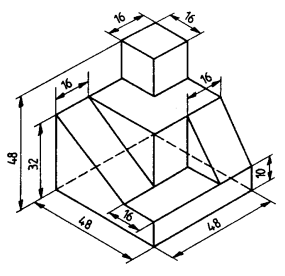

# 2024.03.11 - Szerkezettan #1 / Technológia #1

## Szerkezettan

[Sankey Diagram](https://en.wikipedia.org/wiki/Sankey_diagram){:target="_blank"}

### Motor bevezető 

:construction: Under Construction :construction:

## Technológia

## Órán prezentált PDF-ek

* [Műszaki rajz alapjai](../assets/presentations/20240311/MAMI_Szakrajz.pdf){:target="_blank"}

### Házi feladat

!!! warning
    **Határidő:** 03.27-et beszéltünk meg (következő Technológia óra)

    <figure markdown="span">
    
    </figure>

    **Feladat:** A [Műszaki rajz alapjai](../assets/presentations/20240311/MAMI_Szakrajz.pdf){:target="_blank"} PDF-ből, 27. oldalon lévő összetett mértani test vetületi ábrázolása 3 irányból (szemből, balról, felülről). "Lehetőleg egy A4-es oldalt használva, méretarányosan".