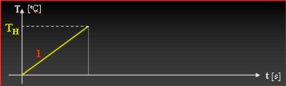
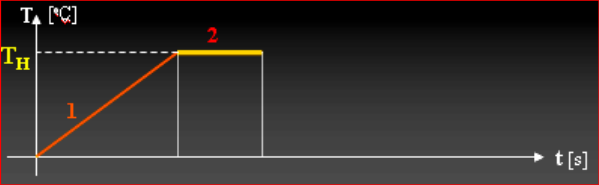
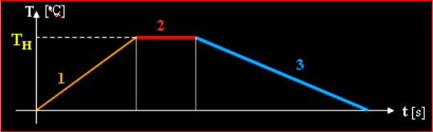
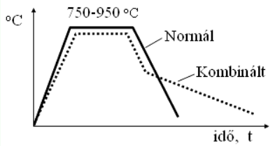
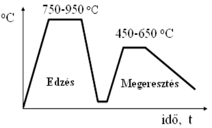
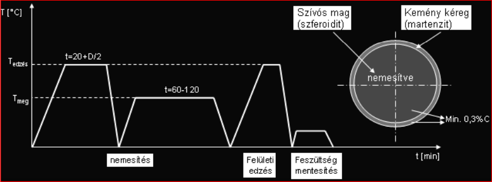
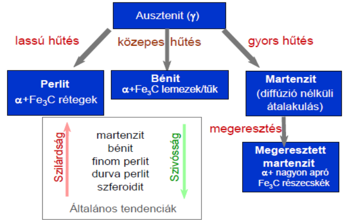

# Hőkezelés

## Órán használt slideok (PDF-re konvertálva)

* [Hőkezelés](../assets/presentations/20240313/Hokezeles.pdf){:target="_blank"}

## Célja

Az acél szövetszerkezetének a technológiai, illetve a felhasználási céloknak leginkább megfelelő tulajdonságot mutató állapotba hozása.

## Lényege

Az acélt különböző „hőkezelési hőmérsékletre” hevítve, ezután másmás sebességgel lehűtve a szövetszerkezet megváltozik, amely az anyagnak új tulajdonságokat ad.

## Folyamata

### **Hevítés** a megfelelő hőmérsékletre
<figure markdown="span">

</figure>

 * A túl gyors hevítés a külső és belső anyagrészek között feszültséget okoz, a túl lassú pedig szemcsedurvulással jár, ezért a hevítést optimalizálni kell
 * Melegítés során lassan kell a hőmérsékletet növelni, hogy az anyag egyenletesen hevüljön át. Különösen olyan tárgyaknál, ahol nagy átmérőkülönbségek vannak, könnyen olyan nagy belső feszültségek ébrednek, ami repedéshez vezethet, illetve a kiálló vékonyabb részek túlhevülhetnek. Az ilyen részeket védőborításokkal kell ellátni
 * A túl lassú hevítés a krisztallitok megnövekedéséhez, a szemcseszerkezet durvulásához vezethet.

### **Hőntartás** a hőkezelési hőmérsékleten

<figure markdown="span">

</figure>
* Az anyag belső részeinek is át kell venniük az adott hőmérsékletet, de a túl hosszú ideig tartó hőntartás szemcsedurvuláshoz vezet
* Megfelelő időre van szükség, míg a tárgy teljes keresztmetszetében átveszi a kívánt hőfokot, vagy ha kell megtörténik az allotrópikus átalakulás
* Bizonyos eljárásoknál viszont csak a kívánt rétegvastagságig bekövetkező átalakulás a cél

### **Hűtés** a megfelelő sebességgel

<figure markdown="span">

</figure>

* A túl gyors hűtés a külső és belső anyagrészek között feszültséget okoz,a túl lassú pedig a hőkezelés eredménytelenségéhez vezethet
* Hűtésnél figyelembe kell venni a tárgy méretét, alakját a rajta levő méretváltozásokat
* Éles bemetszéseknél is repedések keletkezhetnek, ezért ezeket védeni kell
* A hűtőfürdőbe mártáskor a tárgy a legkisebb felületen érintkezzen a közeggel, mert ilyenkor az elvetemedés lehetősége a legkisebb
* Vízzel való hűtéskor a tárgyat mozgatni kell, mert a víz forrásakor helyileg kialakuló gőznek rossz a hűtőhatása, és ez egyenlőtlen szövetszerkezetet eredményez.

## Hőkezelési eljárások

* Hőkezeléssel az acélok szövetszerkezete és így az anyag tulajdonságai is megváltoznak
* Befolyásoló tényezők:
    * hevítés hőfoka
    * hőntartás ideje
    * kritikus hűtési sebesség
    * alkalmazott hűtési sebesség 
* Hőkezelési eljárások csoportosítása:
    * kiegyenlítő hőkezelések
    * lágyító hőkezelések
    * keménységfokozó hőkezelések
    * szívósságot fokozó hőkezelések
    * kéregötvöző hőkezelések

## Az acélok hőkezelése

* Az acélok alapvetően fontos tulajdonságai a szilárdság, a szívósság és az alakíthatóság
* Ötvözéssel, hőkezeléssel ezek a tulajdonságok bármely más fémnél nagyobb mértékben változtathatók
* Hőkezeléskor tehát a fémek kristály- és szövet-szerkezetének, szemcseméretének módosításával tudjuk a mechanikai tulajdonságokat megváltoztatni

### Edzés - keménységfokozó hőkezelés

<figure markdown="span">

</figure>

* Cél az anyag keménységének fokozása
* Hűtés: normál edzésnél vízben, kombinált edzésnél vízben, majd olajban.

### Nemesítés - szívósságot növelő hőkezelés

<figure markdown="span">

</figure>

* Az egymást követő edzés plusz megeresztés, az anyag szívósságát fokozza
* Hűtés először vízben, majd melegítés olajban, befejező hűtés levegőn

### Felületi hőkezelések

<figure markdown="span">

</figure>

* Az acélok hőkezelési eljárásait az elérhető tulajdonságváltozások szerint lehet csoportosítani
* A mag és a kéreg tulajdonágainak beállítása
* Cél: nagyszilárdságú szívós magon kemény kopásálló réteg létrehozása
* Nemesítés (edzés + magas hőmérsékletű megeresztés) + felületi edzések

### Hőkezelési folyamatok összegzése

<figure markdown="span">

</figure>
