# Szakítódiagram

## Órán használt slideok (PDF-re konvertálva)

* [Szakítódiagram](../assets/presentations/20240313/Szakitodiagram.pdf){:target="_blank"}

## Szakítószilárdság fogalma

<figure markdown="span">
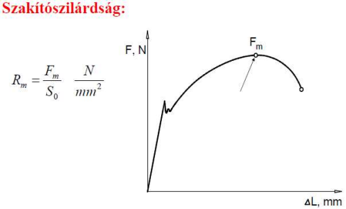
</figure>

**A szakítószilárdság** az anyagnak csak az állandó terheléssel szembeni szilárdságára ad felvilágosítást, dinamikus igénybevételt csak jóval kisebb terhelésnél bír ki az anyag.
A szakítószilárdság a hőmérséklet függvényében változik (általában csökken), magasabb hőmérsékleten állandó terhelés alatt az anyag állandóan növekvő alakváltozást szenved (tartósfolyás).

<figure markdown="span">    
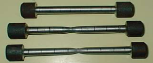
<figcaption>Próbatest</figcaption>
</figure>

**A szakítószilárdság megállapítására** az anyagból szabvány szerint elkészített próbatesten statikus szakítóvizsgálatot végeznek, ami azt jelenti, hogy lassan növelik a húzóerőt és közben a gép felveszi a feszültség-alakváltozás diagramját.
Az anyag tönkremenetel többféleképpen értelmezhető.

## A mérés elve

<figure markdown="span">    
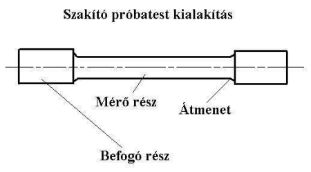
<figcaption>Próbatest kialakítása</figcaption>
</figure>

Az S~0~ kiinduló keresztmetszetű és L~0~ kezdeti hosszúságú próbatestet egytengelyű húzó igénybevétellel adott sebesség mellett addig nyújtunk, ameddig be nem következik a szakadás. A vizsgálat során mérjük a terhelés változását a darab nyúlásának függvényében.

## Szakítóvizsgálat

I. Rugalmas alakváltozás - A terhelés megszűnése után a darab visszanyeri eredeti alakját

II. Egyenletes alakváltozás - A képlékeny deformáció a mérőhossz minden egyes pontján azonos

III. Kontrakció - A képlékeny deformáció egy szűk tartományra korlátozódik

<figure markdown="span">
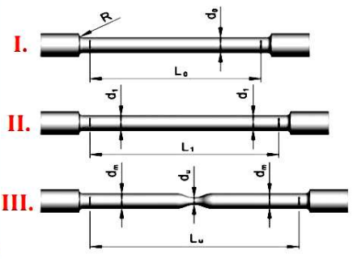
</figure>

<figure markdown="span">
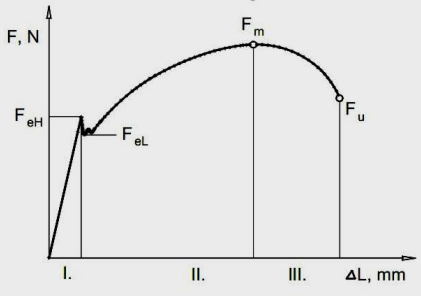
</figure>

### Szakítóvizsgálat Fogalmak

<figure markdown="span">
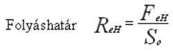
</figure>
* **Folyáshatár (R~e~)**: az a feszültség, melyet az anyag maradó alakváltozás nélkül elvisel. Ez a pont nem mindig pontosan meghatározható, ezért helyette némely anyagnál azt a feszültséget tekintik folyáshatárnak, melynél a maradó alakváltozás 0,2%.

<figure markdown="span">
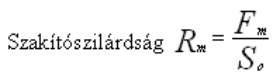
</figure>
* **Szakítószilárdság (R~m~)**: az anyag által törés nélkül kibírt legnagyobb feszültség

<figure markdown="span">
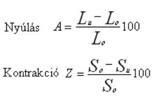
</figure>

* **Szakadás**: A szakítódiagramról leolvasható feszültség, ahol az anyag
elszakad.

### Szakítódiagram anyagfajták szerint

#### Kis széntartalmú szénacél szakítódiagramja és nevezetes pontjai

<figure markdown="span">
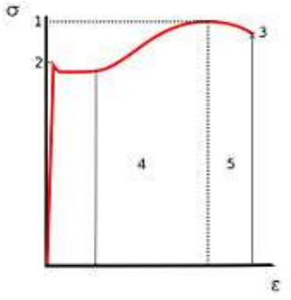
</figure>

1. Szakítószilárdság (R~m~)
2. Folyáshatár (R~e~)
3. Szakadás
4. Felkeményedés
5. Kontrakció (keresztmetszet összehúzódás)

#### Alumínium szakítódiagramja és nevezetes pontjai

<figure markdown="span">
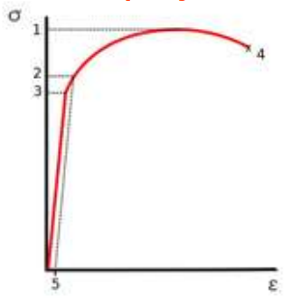
</figure>

1. Szakítószilárdság, Rm
2. 0,2%-os határ, R0,2
3. Arányossági határ
4. Szakadás
5. 0,2% fajlagos nyúlás

#### Különleges rideg anyag szakítódiagramja és nevezetes pontjai

<figure markdown="span">
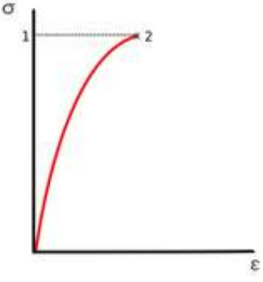
</figure>

1. Szakítószilárdság, Rm
2. Szakadás

### Szakítóvizsgálat eszközei

Szakítógépek típusai:

* Mechanikus
* Hidraulikus
* Elektromechanikus

<figure markdown="span">
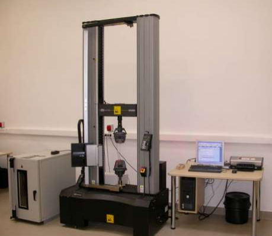
<figcaption>Szakítógép: számítógéppel összekötve</figcaption>
</figure>

<figure markdown="span">
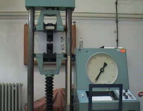
<figcaption>Szakítógép: mechanikus</figcaption>
</figure>

Elvégzendő feladatok:

* Szakítás
* Hengeres próbatest szakítása
* Valódi feszültség–valódi nyúlás görbe felvétele
* A szabványos mérőszámok meghatározása

### Befolyásoló tényezők

A szakítóvizsgálat során kapott eredményeket befolyásoló tényezők:

* A próbatest alakja, mérete, felületi minősége
* A terhelés növelésének sebessége
* A vizsgálati körülmények pl. a hőmérséklet

<figure markdown="span">
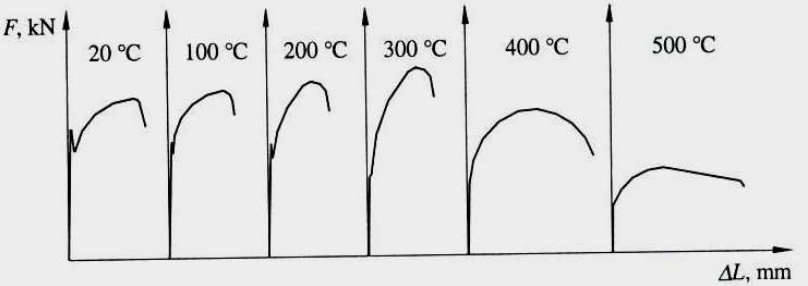
<figcaption>Az acél viselkedése magasabb hőmérsékleten</figcaption>
</figure>

### Jellegzetes szakítódiagramok

<figure markdown="span">
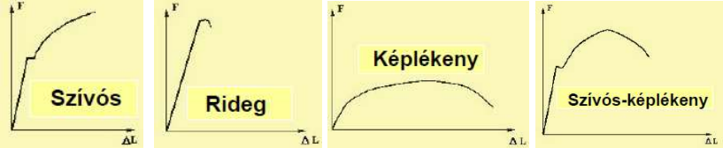
<figcaption>Jellegzetes szakítódiagramok</figcaption>
</figure>

<figure markdown="span">
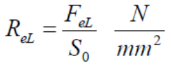
<figcaption>Alsó Folyáshatár</figcaption>
</figure>

<figure markdown="span">
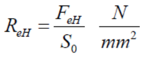
<figcaption>Felső Folyáshatár</figcaption>
</figure>

Ahol S~0~ a próbatest eredeti keresztmetszete.

<figure markdown="span">
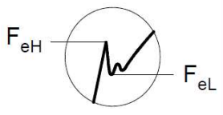
</figure>

### Gyakorlás

!!! note "Gyakorló feladat órán"
    Adott: d = 10mm, F = 30.000N

    Feladat: Számoljuk ki a szakítószilárdságot!

    **Megoldás:**

    R~e~(m) = F/S

    S = d^2^*π/4

    S = 10^2^*π/4 = 78.5mm^2^
    
    R~e~(m) = 30.000N / 78.5mm^2^ = 382.16 N/mm^2^