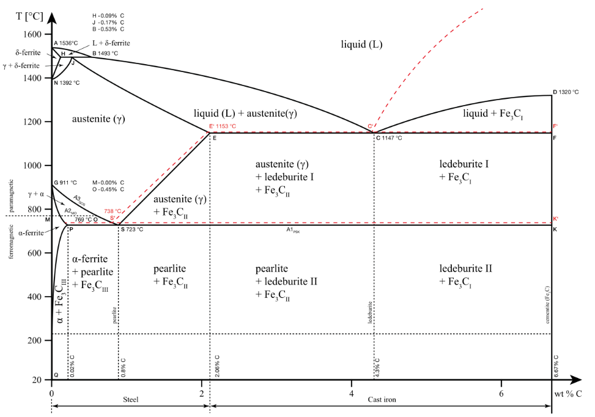
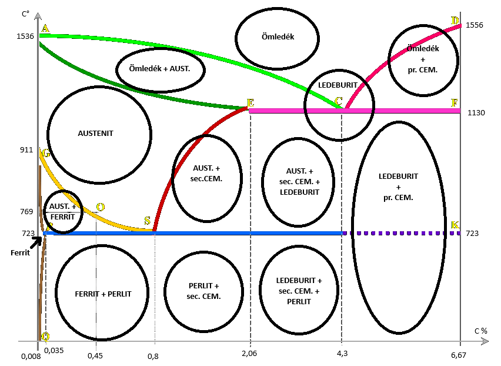

# Vas-szén Ötvözetek

## Órán használt slideok (PDF-re konvertálva)

* [Vas-Szén Ötvözetek Állapotábra](../assets/presentations/20240313/VasSzenOtvozetAllapotAbra.pdf){:target="_blank"}

## Hasznos Linkek
* [Görög ABC](https://en.wikipedia.org/wiki/Greek_alphabet){:target="_blank"}
* [BME - Anyagtudomány és Technológia Tanszék - Fe-C állapotábra](https://www.att.bme.hu/neptuncode/BMEVEFAA602/eloadasok/05_Fe-C_allapotabra.pdf){:target="_blank"}

<figure markdown="span">
    
    <figcaption>Iron-Carbon Phase Diagram</figcaption>
</figure>

<figure markdown="span">
    
    <figcaption>Vas-szén ötvözet állapotábra (órai példa) 
    pr = Primer, sec = Szekunder</figcaption>
</figure>

## [Austenite](https://en.wikipedia.org/wiki/Austenite){:target="_blank"}

* γ - lapközepes köbös térrácsú vasban oldott vaskarbid
* A vasban a vaskarbid (ötvöző) teljes egészében oldott állapotban van jelen, tehát HOMOGÉN szövetszerkezetet mutat, ezért képlékenyen jól alakítható! Megdermedéskor keletkezik.
* Az A (1536 fok; 0%C) – G (911 fok; 0%C) – S (723 fok; 0%C) – E (1130 fok; 2,06 %C) pontok által határolt területen van jelen tisztán AUSTENITES szövetszerkezet, tehát 723 fok alatt nincs AUSTENIT !

## [Ledeburite](https://en.wikipedia.org/wiki/Ledeburite){:target="_blank"}

* Finomeloszlású keverék: EUTEKTIKUM
* Ha az ötvözőtartalom az egyensúlyi állapotnak felel meg (4,3%C), akkor a dermedés 1130 fokon kezdődik, és ezen az állandó hőmérsékleten fejeződik be. Eközben a vas és a vaskarbid finomeloszlású keveréket alkot: ez a LEDEBURIT.
* Az EUTEKTIKUM-pont a vas – vaskarbid állapotábrában a „C” pont: 1130 fokon; 4,3% C tartalom mellett.
* A kb. 4,3%C–tart.körüli vasötözet közel állandó hőmérsékleten dermed, ezért igen jól önthető, mert az öntvény hűlés közben nem húzódik el!

## Primer [Cementit](https://en.wikipedia.org/wiki/Cementite){:target="_blank"} + Ledeburite

* Primer CEMENTIT [vaskarbid (Fe~3~-C)] + Eutektikum
* A dermedés során az ömledékből primer CEMENTIT válik ki, mert az ötvözőtartalom nagyobb az egyensúly jelentő 4,3 %-nál.
* Ezért az ömledék széntartalma csökken, egészen 4,3 %-ig, ami 1130 fokon következik be, ekkor az egyensúlyi állapotnak megfelelően a ömledék állandó hőmérsékleten EUTEKTIKUMMÁ, azaz finomeloszlású keverékké alakul: ez a LEDEBURIT.
* Ez a szövetszerkezet csak 4,3%C felett van jelen, és 1130 fok alatt !
* Rendkívül rideg, főleg nagyobb C tartalomnál nincs gyakorlati alkalmazása

## [Ferrite](https://en.wikipedia.org/wiki/Ferrite_(magnet))

* Az α vas maximum 0,035% ötvözőt tud oldatban tartani, de műhelyhőmérsékleten csak 0,005%-ot.
* A tisztán FERRITES szövetszerkezet nagyon lágy, ezért a fémipar
nem alkalmazza.
* Mivel igen jól mágnesezhető, az elektronikában nagy szerepe van, Pl.: hangszórók, mikrofonok, stb.

## Ferrite + Perlite

* A G-O-S vonal (A3 felső átalakulási hőmérséklet)mentén vált ki a FERRIT, mert „C” tartalom az egyen–súlyi 0,8%-nál kisebb („S” eutektoid pont), ezzel az AUSTENIT relatív ötvöző-tartalomban dúsul, egészen 0,8% C tartalomig.
* 723 fokon (A1 alsó átalakulási hőmérséklet) az AUSTENIT PERLITTÉ alakul. A PERLIT FERRITBE ágyazódott lemezes CEMENTIT.
* A FERRIT + PERLIT szövetszerkezet elég lágy, viszonylag szívós, ez főleg az alacsonyabb „C” tartalmakra érvényes. Ilyen szövet – szerkezet 0,035% - 0,8% „C” tartalomig, 723 fok (A1) alatt jellemzi a vasötvözeteket.
* Ezzel a szövetszerkezettel rendelkeznek a **SZERKEZETI acélok.**

## Szekunder Cementit + Perlite

* Az E-S vonal mentén vált ki a szekunder CEMENTIT, mert „C” tartalom az egyensúlyi 0,8%-nál nagyobb ezzel az AUSTENIT relatív ötvöző-tartalma csökken, egészen 0,8% C tartalomig. A kiválás már a megszilárdult AUSTENITBŐL történik innen a „szekunder” név.
* A sec. CEMENTIT az AUSTENIT kristályok határára diffundál ki, hálószerűen körülvéve azokat.
* 723 fokon (A1) az AUSTENIT PERLITTÉ alakul.
* A PERLIT + sec.CEM szövetszerkezet elég rideg és kemény.Ez főleg a magasabb „C” tartalmakra érvényes. Ilyen szövetszerkezet 0,8% - 2,06% „C” tartalomig, 723 fok (A1) alatt jellemzi a vasötvözeteket.
* Ezzel a szövetszerkezettel rendelkeznek a **SZERSZÁM-acélok.**

## Ledeburite + szek. Cementit + Perlite

* Ez a szövetszerkezet 2,06% - 4,3% „C” tartalom mellett jön létre 723 fokon
* Az egyensúlyi összetétel (4,3% „C”) alatt az ömledékből AUSTENIT krisztallitok válnak ki, ezzel az ömledék relatív ötvöző-tartalma nő, egészen 4,3%-ig.Ez 1130 fokon következik be, ekkor állandó hőmérsékleten LEDEBURIT képződik.
* Mivel a szilárd állapotbeli egyensúlyi állapotnak megfelelő „C” tartalomnál (0,8%) viszont nagyobb az ötvöző-tartalom ezért hűlés közben az E-S vonal mentén szekunder CEMENTIT válik ki.
* Az A1 hőmérsékleten AUSTENIT PERLIT átalakulás következik be
* Főleg az EUTEKTIKUM-pont közelében (4,3% „C”) jól önthető: **ÖNTÖTT VASAK**
