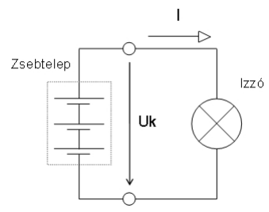

# 2024.03.20 - Elektrotechnika #1

## Hasznos PDF-ek

* [Elektrotechnika Alapok](../assets/presentations/20240320/elektroalapok.pdf) (lényegében az órai anyag)
* [Villamos alapismeretek és elektronika jegyzet](../assets/presentations/20240320/elektrojegyzet.pdf) (könyv helyett)

## Fogalmak

### Cheat Sheet

| Név                   | Definíció                                                           | Jele           | Mértékegység                   |
| --------------------- | ------------------------------------------------------------------- | -------------- | ------------------------------ |
| Feszültség            | Ellentétes töltések szétválasztásával végzett munka                 | U              | Volt (V)                       |
| Áramerősség           | Az elektromos töltések áramlása                                     | I              | Amper (A)                      |
| Ellenállás            | Az áramot korlátozó hatás (/áramköri elem)                          | R              | Ohm (Ω - Omega)                |
| Vezetés               | A vezetés az ellenállás reciproka                                   | G              | Siemens (S)                    |
| Fajlagos Ellenállás   | 1 méter hosszú, 1 mm^2^ keresztmetszetű vezető ellenállása 20 C°-on | ρ (rho - "ró") | (Ohm*mm^2^) / m                |
| Villamos Munka        | Az áramerősség és az eltelt idő szorzata                            | W~vill~        | Wattszekundum (Ws) = Joule (J) |
| Villamos Teljesítmény | Egységnyi idő alatt végzett munka                                   | P              | Watt (W)                       |

### Feszültség

$$ U = { I * R} $$

* Ellentétes töltések szétválasztásával végzett munka
* Jele: U (egyenfeszültség) u (váltakozó feszültség)
* Mértékegysége: Volt (V)

<figure markdown="span">

<figcaption>Feszültségforrások rajzjelei - A - Generátor általában, B - Forgó generátor, C - Feszültséggenerátor, D - Tápegység, E - Szárazelem vagy akkumulátor</figcaption>
</figure>

<figure markdown="span">

<figcaption>Feszültség irányának jelölése - A feszültség irányát nyitott nyíllal jelöljük, amely a pozitívabb ponttól a negatívabb felé muta</figcaption>
</figure>

#### Feszültségnemek

<figure markdown="span">

<figcaption>Egyenfeszültségek időfüggvényei</figcaption>
</figure>

!!! Note "Egyenfeszültség"
    Az egyenfeszültség csak pozitív vagy csak negatív lehet.

    Stacionárius: a feszültség nagysága állandó

<figure markdown="span">

<figcaption>Váltakozó feszültségek időfüggvényei</figcaption>
</figure>

!!! Note "Váltakozó feszültség"
    A váltakozó feszültség pozitív és negatív görbe alatti területének nagysága megegyezik. 

<figure markdown="span">

<figcaption>Kevert feszültségek időfüggvényei</figcaption>
</figure>

!!! Note "Kevert feszültség"
    A kevert feszültség pozitív és negatív görbe alatti területének nagysága nem egyezik meg

### Áramerősség

$$ I = { U \over R} $$

* Az elektromos töltések áramlása
* Jele: I (egyenáram) i (váltakozó áram)
* Mértékegysége: Amper (A)

<figure markdown="span">

<figcaption>Egyszerű áramkör kapcsolási rajza - I = áram iránya</figcaption>
</figure>

!!! note "Áramirányok"
    Technikai áramirány: a pozitív, míg a fizikai áramirány a negatív töltéshordozók áramlásának iránya. 

### Ellenállás

$$ R = { U \over I} $$

* Az áramot korlátozó hatás (/áramköri elem)
* Jele: R
* Mértékegysége: Ohm (Ω - Omega)

<figure markdown="span">

<figcaption>Ellenállás Áramköri jele</figcaption>
</figure>

### Vezetés

$$ G = { 1 \over R} $$

* A vezetés az ellenállás reciproka
* Jele: G (konduktancia)
* Mértékegysége: Siemens (S)

### Fajlagos Ellenállás

* 1 méter hosszú, 1 mm^2^ keresztmetszetű vezető ellenállása 20 C°-on
* Jele: ρ (rho - "ró")
* Mértékegysége:

$$ { Ω * mm^2 \over m} $$

* Réz fajlagos ellenállása 0.0178

### Villamos Munka

* Elektromos fogyasztó által végzett munka a feszültség, az áramerősség és az eltelt idő szorzata
* Jele: W~vill~ 
* Mértékegysége: Wattszekundum (Ws) = Joule (J)

$${ W = U * I * t}$$

### Villamos Teljesítmény

* Egységnyi idő alatt végzett munka
* Jele: P
* Mértékegysége: Watt (W)

$${ P = {W \over t} = {U * I * t \over t} = U * I} $$

## Törvények

### Ohm Törvény

Ohm törvénye egy fizikai törvényszerűség, amely egy fogyasztón (pl. elektromos vezetékszakaszon) átfolyó áram erőssége és a rajta eső feszültség összefüggését adja meg.

$${ I = {U \over R}}$$

$${ R = {U \over I}}$$

$${ U = I * R}$$

### Kirchoff I. - Csomóponti törvény

Egy áramköri csomópontba befolyó és elfolyó áramok algebrai összege 0.

<figure markdown="span">

<figcaption>-i1 + i2 - i4 + i3 = 0 -> ebből következik, hogy i1 + i4 = i2 + i3</figcaption>
</figure>

### Kirchoff II. - Huroktörvény

Egy zárt áramköri hurokban a feszültségek algebrai összege 0.

<figure markdown="span">

<figcaption>Ug + U1 + U2 = 0 -> ebből következik, hogy Ug = U1 + U2</figcaption>
</figure>

## Ellenállások Soros Kapcsolása

<figure markdown="span">

</figure>

Eredő ellenállás soros kapcsolás esetén = Ellenállások értékének összege

$${R_e = R_1 + R_2 + R_3 + ... + R_n}$$

## Ellenállások Párhuzamos Kapcsolása

<figure markdown="span">

</figure>

Eredő ellenállás párhuzamos kapcsolás esetén = Ellenállások "[replusza](https://hu.wikipedia.org/wiki/Replusz)". 

$${R_e = R_1 x R_2 = {R_1 * R_2 \over R_1 + R_2}}$$

!!! note "Replusz"
    Replusz csak páronként számolható!
    Pl. 3 párhuzamosan kapcsolt ellenállás esetén R~e~ = (R~1~xR~2~)xR~3~, 4 ellenállás esetén R~e~ = (R~1~xR~2~)x(R~3~xR~4~)