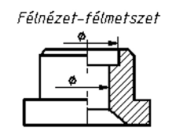
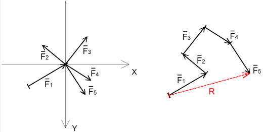

# 2024.03.27 - Technológia #2

## Házi feladat

!!! warning "Házi Feladat"
    Emlékeztető: [Előző technológia órán](../20240311/20240311.md){:target="_blank"} volt házi feladat, amit erre az órára kell elkészíteni.
    
## Hasznos PDF-ek

* [Keménységmérési Eljárások](../assets/presentations/20240327/kemenysegmeres.pdf){:target="_blank"}

## Mechanika

### Ötvözetek

#### Szilárd Oldat

* Fizikai kapcsolatban van az alapfém és az ötvöző anyag
    * Helyettesítéses / Szubsztitúciós rácsszerkezet
    * Beékelődéses / Intersztíciós rácsszerkezet
* Tulajdonságai:
    * Rugalmas
    * Képlékeny
    * Alakítható
    * Nem törékeny

#### Fémes Vegyület

* Az alapfém atomjai és az ötvözőanyag atomjai bonyolult molekuláris kapcsolatban vannak egymással
* Tulajdonságai:
    * Kemény
    * Rideg
    * Törékeny

### Keménységmérési Eljárások

#### Brinnel keménységmérés

<figure markdown="span">
{width=400}
</figure>

* A Brinell-módszer esetén egy D átmérőjű, edzett vagy keményfém, polírozott acélgolyót nyomnak a vizsgálandó munkadarab felületébe, a felületre merőlegesen, meghatározott terheléssel és adott ideig.
* Brinell keménységen a terhelő erő és a lenyomat felületének hányadosát értjük
* Jele: HB

#### Vickers keménységmérés

<figure markdown="span">
{width=250}
</figure>

* A Brinell-keménységmérés hibája, hogy a golyó átmérőjétől és a terheléstől függ a HB nagysága és így nem ad eléggé jól összehasonlítható értékeket. Ezen kívül nagyobb keménységű anyagok mérésére a golyó torzulása miatt nem alkalmas
* A Vickers keménységmérés szúrószerszáma egy olyan négyzet alapú, egyenes gyémánt gúla,
amelynek lapszöge 136°
* Jele: HV

#### Rockwell keménységmérés

<figure markdown="span">
{width=400}
</figure>

* A Vickers-féle keménységmérésnek sok előnye mellett hátránya az, hogy nem eléggé gyors, a gyártósorba iktatott tömeges keménységmérésre nem alkalmas. Erre a célra a Rockwellféle keménységmérő eljárást dolgozták ki, melynek szúrószerszáma, vagy gyémántból készült kör alapú egyenes kúp, 120º-os kúpszöggel
* A keménység mérőszáma a szúrószerszám bemélyedésének függvénye és egy mérőórán általában közvetlenül elolvasható
* Jele: HRC / HRA

## Technológia

### Metszeti ábrázolás

* Teljes nézet
* Teljes metszet
* Félmetszet
* Félnézet-félmetszet

<figure markdown="span">
{width=400}
<figcaption>Teljes metszet</figcaption>
</figure>

<figure markdown="span">
{width=200}
<figcaption>Félmetszet</figcaption>
</figure>

<figure markdown="span">
{width=200}
<figcaption>Félnézet félmetszet</figcaption>
</figure>

### Erő

* Különböző testek mechanikai kölcsönhatásának mértéke. Az erő nagysággal, iránnyal és hatásvonallal jellemezhető, vektor segítségével ábrázolható mennyiség
* Jele: F (Force)
* Mértkegysége: N (Newton)

#### Közös metszéspontú erőrendszer eredője

<figure markdown="span">
{width=400}
<figcaption>Az alábbi ábrán az F1 és F2 vektorok grafikus összegzése látható</figcaption>
</figure>

Eredő értékének meghatározása:

$$ R(F_e) = F_1 + F_2 + ... + F_n$$

#### Erőrendszer Egyensúlya

Az erőrendszert egyensúlyi erőrendszernek nevezzük, ha az erőrendszer eredője zéruserő.

$$F_1 + F_2 + ... + F_n = 0$$

### Forgatónyomaték 

<figure markdown="span">
{width=400}
</figure>

* A forgatónyomaték egy adott erőhatás egy adott forgástengelyre való forgatóképességét megadó fizikai mennyiség
* Jele: M
* Számítása: $M = F * k$
    * Ahol k = erőkar
* Mértékegysége: Nm (NewtonMéter)

### Gyakorló Feladatok

!!! warning "Fontos"
    Ez a számolás fontosnak tűnik, mert elég sok gyakorló példát néztünk rá. Itt most csak egyet vezetek le egyelőre

#### Bevezetés

<figure markdown="span">
{width=400}
</figure>

* F = Koncentrált erő
* A & B = Reakciós erő
* **Egyensúlyi erőrendszer** ($A + B = F$)

#### Első Feladat

<figure markdown="span">
{width=400}
</figure>

Egyensúlyi erőrendszer, ezért az erők összege zéró:

$$ F_e = A - F_1 - F_2 - F_3 + B = 0 $$

Felírjuk az A pontra a forgatónyomaték egyenletét:

$$ M_A = (A * 0m) - (F_1 * 1m) - (F_2 * 2m) - (F_3 * 3m) + (B * 4m) $$

Ebből kiszámoljuk B-t:

$$ 0 - (200N * 1m) - (100N * 2m) - (150N * 3m) + 4B $$

$$ 0 - 200Nm - 200Nm - 450Nm + 4B $$

$$ 4B = 450Nm $$

$$ B = 212.5N $$

Ezt az értéket behelyettesítjük az első egyenletbe:

$$ A - F_1 - F_2 - F_3 + 212.5N = 0 $$

Behelyettesítjük az erők értékeit, majd levezetjük A-ra:

$$ A - 200N - 100N - 150N + 212.5N = 0 $$

$$ A - 450N + 212.5N = 0 $$

$$ A - 237.5N = 0 $$

$$ A = 237.5N $$

